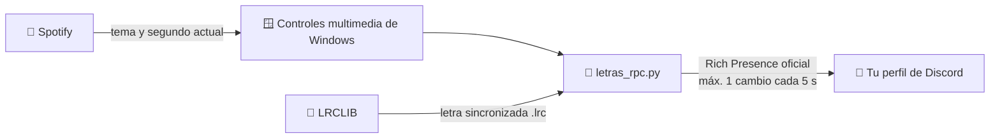

<div align="center">

# 🎤 Letras RPC

**Mostrá en tu perfil de Discord la letra de lo que estás escuchando en Spotify, línea por línea.**


</div>

---

## ✨ ¿Qué hace?

Mientras escuchás música en Spotify, tu perfil de Discord muestra el verso que está sonando en ese momento:

```
🎧 Escuchando Letras RPC
   Y aunque el tiempo pase, sigo acá cantando
   Nombre del tema · Artista
```

- 🎶 **Letra sincronizada** con el segundo exacto de la canción.
- 👥 **Visible en la lista de miembros** del server (opcional).
- ⏸️ **Se oculta sola** cuando pausás o cerrás Spotify.
- 🔒 **Seguro para tu cuenta:** no usa tu token ni modifica Discord.

---

## 🧠 ¿Cómo funciona?



1. **Lee Spotify desde Windows.** Usa los mismos controles multimedia que aparecen al subir el volumen, así que no hace falta login ni API de Spotify.
2. **Busca la letra en [LRCLIB](https://lrclib.net).** Es una base de datos gratuita y abierta de letras con marcas de tiempo.
3. **Actualiza tu Rich Presence.** Se conecta al Discord que tenés abierto mediante la vía oficial (IPC local) y con tu propia aplicación.

---

## 🛡️ ¿Me pueden banear?

**No.** Este programa usa solo la vía que Discord ofrece para esto:

| | Letras RPC | Self-bots / plugins de estado |
|---|:---:|:---:|
| Usa tu token de usuario | ❌ No | ⚠️ Sí |
| Modifica el cliente de Discord | ❌ No | ⚠️ Sí |
| API oficial de Rich Presence | ✅ Sí | ❌ No |
| Respeta el rate limit | ✅ Siempre | 🤷 Depende |
| Riesgo de ban | 🟢 Ninguno | 🔴 Alto |

**Protecciones incluidas:**

- ⏱️ Nunca manda más de **un cambio cada 5 segundos** (Discord permite 5 cada 20 s). Esto aplica también al ocultar la presencia cuando pausás.
- 🔁 Si Discord rechaza algo, **no reintenta en ráfaga**: espera y reconecta con tiempos crecientes (10 s → 20 s → 40 s → 60 s).
- 📏 Recorta los textos al largo permitido por Discord (entre 2 y 128 caracteres).

> [!NOTE]
> Por ese límite, en canciones muy rápidas (rap, por ejemplo) se van a saltear algunas líneas. Es una limitación de Discord, no del programa.

---

## 📦 Instalación

### 1. Requisitos

- 🪟 Windows 10 u 11
- 🐍 [Python 3.10 o superior](https://www.python.org/downloads/): al instalarlo, marcá **"Add Python to PATH"**
- 🎧 La app de escritorio de Spotify
- 💬 La app de escritorio de Discord (en el navegador no funciona Rich Presence)

### 2. Descargá el proyecto

```bash
git clone https://github.com/tomasamrein/letras-rpc.git
cd letras-rpc
```

O usá **Code → Download ZIP** y descomprimilo.

### 3. Instalá las dependencias

```bash
pip install -r requirements.txt
```

### 4. Creá tu app de Discord (2 minutos)

1. Entrá a **[discord.com/developers/applications](https://discord.com/developers/applications)**.
2. Tocá **New Application**. El nombre que elijas es el que va a aparecer como *"Escuchando **ese nombre**"*. Por ejemplo: `Letras`, `🎤 Karaoke` o `lo que suena`.
3. En **General Information**, copiá el **Application ID**.
4. *(Opcional)* En **Rich Presence → Art Assets** podés subir una imagen.

### 5. Pegá tu Application ID

Abrí `letras_rpc.py` y reemplazá esta línea:

```python
CLIENT_ID = os.environ.get("LETRAS_RPC_CLIENT_ID", "PEGA_ACA_TU_APPLICATION_ID")
```

por:

```python
CLIENT_ID = os.environ.get("LETRAS_RPC_CLIENT_ID", "123456789012345678")
```

### 6. ¡A cantar! 🎤

Con Discord y Spotify abiertos, ejecutá esto:

```bash
python letras_rpc.py
```

Deberías ver:

```
[discord] conectado
Listo. Poné música en Spotify. Ctrl+C para salir.
[tema] Nombre del tema - Artista
[letra] encontrada
```

> [!TIP]
> En Discord, entrá a **Configuración → Privacidad de actividad** y activá **"Compartir tu actividad"**. Si no, nadie más va a ver la letra.

---

## ⚙️ Configuración

Todo se ajusta al principio de `letras_rpc.py`:

| Opción | Por defecto | Para qué sirve |
|---|:---:|---|
| `CLIENT_ID` | — | El ID de tu app de Discord. **Obligatorio.** |
| `MIN_SEGUNDOS_ENTRE_UPDATES` | `5` | Tiempo mínimo entre cambios. ⚠️ **No bajar de 5.** |
| `OFFSET_LETRA_SEG` | `0.0` | Adelanta (`+`) o atrasa (`-`) la letra si la ves desfasada. |
| `POLL_SEG` | `1.0` | Cada cuánto mira qué suena (es local, no llama a Discord). |
| `LETRA_EN_LISTA_DE_MIEMBROS` | `True` | Muestra la letra también en la lista de miembros del server. |

---

## ❓ Preguntas frecuentes

<details>
<summary><b>Dice "(sin letra sincronizada)"</b></summary>

LRCLIB no tiene esa canción con marcas de tiempo. Pasa con temas muy nuevos o poco conocidos. Si querés, podés [subir la letra a LRCLIB](https://lrclib.net) para que le sirva a todos.
</details>

<details>
<summary><b>La letra va adelantada o atrasada</b></summary>

Ajustá `OFFSET_LETRA_SEG`. Por ejemplo, `1.0` la adelanta un segundo y `-1.0` la atrasa un segundo.
</details>

<details>
<summary><b>No aparece nada en mi perfil</b></summary>

- Revisá que estés usando **Discord de escritorio**, no el navegador.
- Activá **Configuración → Privacidad de actividad → Compartir tu actividad**.
- Revisá que el `CLIENT_ID` sea el número correcto.
- Cerrá y volvé a abrir Discord con el programa corriendo.
</details>

<details>
<summary><b>¿Se muestra al mismo tiempo que la actividad normal de Spotify?</b></summary>

Sí, Discord puede mostrar varias actividades. Si querés que se vea solo la letra, desactivá **Mostrar Spotify como tu estado** en **Configuración → Conexiones → Spotify**.
</details>

<details>
<summary><b>¿Funciona en Mac o Linux?</b></summary>

Por ahora no. Lee la música desde los controles multimedia de Windows.
</details>

<details>
<summary><b>¿Puedo hacer que arranque solo con Windows?</b></summary>

Sí. Apretá <kbd>Win</kbd> + <kbd>R</kbd>, escribí `shell:startup` y creá ahí un acceso directo a este comando: `pythonw letras_rpc.py`. `pythonw` lo corre sin mostrar ventana.
</details>

---

## 🗂️ Estructura

```
letras-rpc/
├── letras_rpc.py      # el programa
├── requirements.txt   # dependencias de Python
├── README.md          # esto que estás leyendo
└── LICENSE            # MIT
```

---

## 🙌 Créditos

- 📜 Letras: **[LRCLIB](https://lrclib.net)**, base de letras sincronizadas libre y gratuita
- 🔌 Conexión con Discord: **[pypresence](https://github.com/qwertyquerty/pypresence)**
- 🪟 Lectura del reproductor: **[PyWinRT](https://github.com/pywinrt/pywinrt)**

<div align="center">

---

Hecho con 💜 en Argentina

*Si te sirvió, dejale una ⭐ al repo.*

</div>
