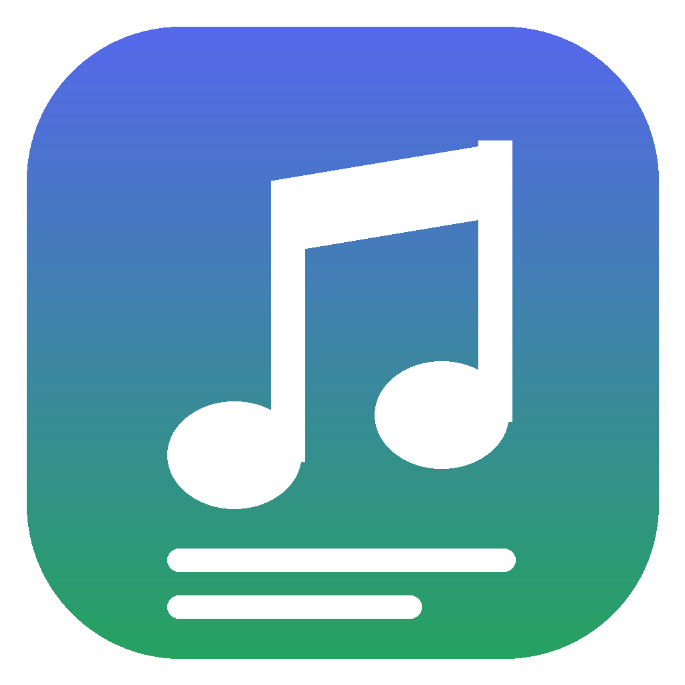
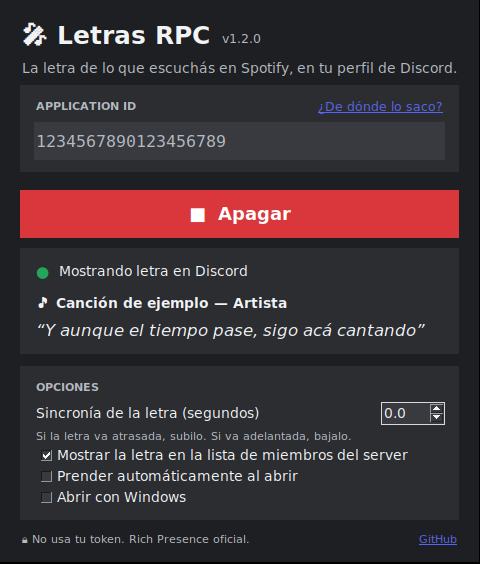
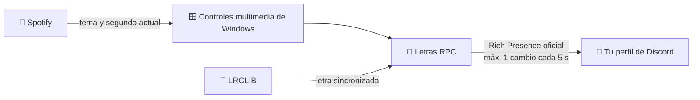

<div align="center">



# Letras RPC

**Mostrá en tu perfil de Discord la letra de lo que estás escuchando en Spotify, línea por línea.**

[](https://github.com/tomasamrein/letras-rpc/releases/latest)
[](https://github.com/tomasamrein/letras-rpc/actions)




</div>

---

## ✨ ¿Qué hace?

Mientras escuchás música en Spotify, tu perfil de Discord muestra el verso que está sonando:

```
🎧 Escuchando Letras
   Y aunque el tiempo pase, sigo acá cantando
   Nombre del tema · Artista
```

- 🎶 **Letra sincronizada** con el segundo exacto de la canción
- 🖱️ **Ventana simple**: pegás tu ID, tocás **Prender** y listo
- 👥 **Visible en la lista de miembros** del server (opcional)
- ⏸️ **Se oculta sola** cuando pausás o cerrás Spotify
- 🚀 **Opción para abrirse con Windows**, minimizado y ya prendido
- 🔒 **Seguro para tu cuenta**: no usa tu token ni modifica Discord

---

## 🚀 Empezar en 3 pasos

### 1. Descargá el programa

👉 **[Descargar LetrasRPC.exe](https://github.com/tomasamrein/letras-rpc/releases/latest)**

Es un solo archivo. No hace falta instalar Python ni nada más.

> [!NOTE]
> Si Windows muestra **"Windows protegió su PC"**, tocá **Más información → Ejecutar de todas formas**. Aparece porque el programa no está firmado digitalmente (el certificado cuesta caro), no porque tenga algo malo. Todo el código está en este repo, y el `.exe` se compila automáticamente desde acá con GitHub Actions.

### 2. Conseguí tu Application ID (2 minutos, una sola vez)

1. Entrá a **[discord.com/developers/applications](https://discord.com/developers/applications)** con tu cuenta de Discord.
2. Tocá **New Application**. El nombre que elijas es lo que aparece como *"Escuchando **ese nombre**"*. Por ejemplo: `Letras`, `🎤 Karaoke` o `lo que suena`.
3. En **General Information**, copiá el **Application ID**.

> En la ventana también está el link **¿De dónde lo saco?**, que te lleva directo.

### 3. Pegalo y prendelo

Abrí **LetrasRPC.exe**, pegá el ID y tocá **▶ Prender**. Con Discord y Spotify abiertos, la letra aparece en tu perfil. 🎤

> [!TIP]
> En Discord, activá **Configuración → Privacidad de actividad → Compartir tu actividad**. Si no, nadie más va a ver la letra.

---

## 🎛️ Opciones de la ventana

| Opción | Qué hace |
|---|---|
| **Sincronía de la letra** | Si la letra va atrasada, subilo (`+0.5`, `+1`…). Si va adelantada, bajalo. Se aplica en vivo. |
| **Mostrar la letra en la lista de miembros** | En la lista del server se ve *"Escuchando «la letra»"* en vez del nombre de la app. |
| **Prender automáticamente al abrir** | No hace falta tocar **Prender** cada vez. |
| **Abrir con Windows** | Arranca minimizado y ya prendido al encender la PC. |

La configuración se guarda en `%APPDATA%\LetrasRPC\config.json`.

---

## 🧠 ¿Cómo funciona?



1. **Lee Spotify desde Windows.** Usa los mismos controles multimedia que aparecen al subir el volumen, así que no hace falta login ni API de Spotify.
2. **Busca la letra en [LRCLIB](https://lrclib.net).** Es una base de datos gratuita y abierta de letras con marcas de tiempo.
3. **Actualiza tu Rich Presence.** Se conecta al Discord que tenés abierto por la vía oficial (IPC local), usando tu propia aplicación.

---

## 🛡️ ¿Me pueden banear?

**No.** Letras RPC usa solo la vía que Discord ofrece para esto:

| | Letras RPC | Self-bots / plugins de estado |
|---|:---:|:---:|
| Usa tu token de usuario | ❌ No | ⚠️ Sí |
| Modifica el cliente de Discord | ❌ No | ⚠️ Sí |
| API oficial de Rich Presence | ✅ Sí | ❌ No |
| Respeta el rate limit | ✅ Siempre | 🤷 Depende |
| Riesgo de ban | 🟢 Ninguno | 🔴 Alto |

**Protecciones incluidas:**

- ⏱️ **Nunca manda más de un cambio cada 5 segundos** (Discord permite 5 cada 20 s). Esto aplica también al ocultar la presencia cuando pausás.
- 🔁 **Si algo falla, no reintenta en ráfaga.** Espera y reconecta con tiempos crecientes (10 → 20 → 40 → 60 s).
- 🪟 **Una sola instancia.** Si ya está abierto, no deja abrir otro, para que no se dupliquen los envíos.
- 📏 **Textos recortados** al largo que acepta Discord (entre 2 y 128 caracteres).

> [!NOTE]
> Por ese límite, en canciones muy rápidas (rap, por ejemplo) se saltean algunas líneas. Es una limitación de Discord, no del programa.

---

## ❓ Preguntas frecuentes

<details>
<summary><b>Dice "Esta canción no tiene letra sincronizada"</b></summary>

LRCLIB no tiene ese tema con marcas de tiempo. Pasa con canciones muy nuevas o poco conocidas. Si querés, podés [subir la letra a LRCLIB](https://lrclib.net) para que le sirva a todos.
</details>

<details>
<summary><b>Dice "No encuentro Discord abierto"</b></summary>

- Abrí **Discord de escritorio**. El del navegador no soporta Rich Presence.
- Si igual no conecta, cerrá Discord del todo (también desde el ícono junto al reloj) y volvé a abrirlo.
</details>

<details>
<summary><b>Dice "Discord rechazó el Application ID"</b></summary>

Copiá de nuevo el **Application ID** desde *General Information*. Es un número de ~19 dígitos. No es el *Public Key* ni el *Client Secret*.
</details>

<details>
<summary><b>Dice "Spotify en pausa o cerrado" pero estoy escuchando</b></summary>

Tiene que ser la **app de escritorio de Spotify**, no el reproductor web.
</details>

<details>
<summary><b>¿Se muestra al mismo tiempo que la actividad normal de Spotify?</b></summary>

Sí, Discord puede mostrar varias actividades. Si querés que se vea solo la letra, desactivá **Mostrar Spotify como tu estado** en **Configuración → Conexiones → Spotify**.
</details>

<details>
<summary><b>El antivirus lo marca como sospechoso</b></summary>

Es un falso positivo común con los programas Python empaquetados en `.exe`. El código es abierto y se compila automáticamente en GitHub. Si preferís, podés correrlo desde el código (más abajo).
</details>

<details>
<summary><b>¿Funciona en Mac o Linux?</b></summary>

Por ahora no. Lee la música desde los controles multimedia de Windows.
</details>

---

## 🧑‍💻 Correrlo desde el código

Para quien prefiera no usar el `.exe`:

```bash
git clone https://github.com/tomasamrein/letras-rpc.git
cd letras-rpc
python -m pip install -r requirements.txt
python app.py
```

También se puede usar sin ventana, desde la consola:

```powershell
$env:LETRAS_RPC_CLIENT_ID = "TU_APPLICATION_ID"
python letras_rpc.py
```

<details>
<summary><b>Compilar el .exe vos mismo</b></summary>

```bash
pip install pyinstaller
pyinstaller --onefile --windowed --name LetrasRPC --icon assets/icono.ico --add-data "assets/icono.ico;assets" --collect-all winrt app.py
```

El `.exe` queda en `dist/`. Cada vez que se sube un tag `v*` al repo, GitHub Actions lo compila y lo publica solo en [Releases](https://github.com/tomasamrein/letras-rpc/releases).
</details>

---

## 🗂️ Estructura

```
letras-rpc/
├── app.py                        # la ventana
├── letras_rpc.py                 # el motor (Spotify → LRCLIB → Discord)
├── requirements.txt              # dependencias de Python
├── assets/                       # ícono y captura
└── .github/workflows/compilar.yml  # compila el .exe automáticamente
```

---

## 🙌 Créditos

- 📜 Letras: **[LRCLIB](https://lrclib.net)**, base de letras sincronizadas libre y gratuita
- 🔌 Conexión con Discord: **[pypresence](https://github.com/qwertyquerty/pypresence)**
- 🪟 Lectura del reproductor: **[PyWinRT](https://github.com/pywinrt/pywinrt)**

<div align="center">

---

Hecho con 💜 en Argentina

*Si te sirvió, dejale una ⭐ al repo.*

</div>
